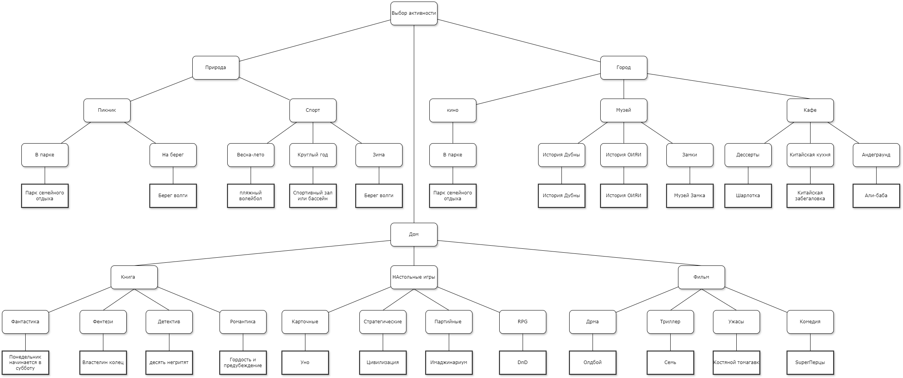

# Сценарная система для выбора активности на выходные в Дубне

Реализована с помощью telegram бота: @bebra_dubna_bot

Сервер написан на NestJs, для запуска - в корневой директории выполнить(должны быть установлены NodeJS и npm):

1. npm i
2. npm run start:dev

## Карта сценария:

В корне лежи еще .drawio файл для просмотра в drawio
